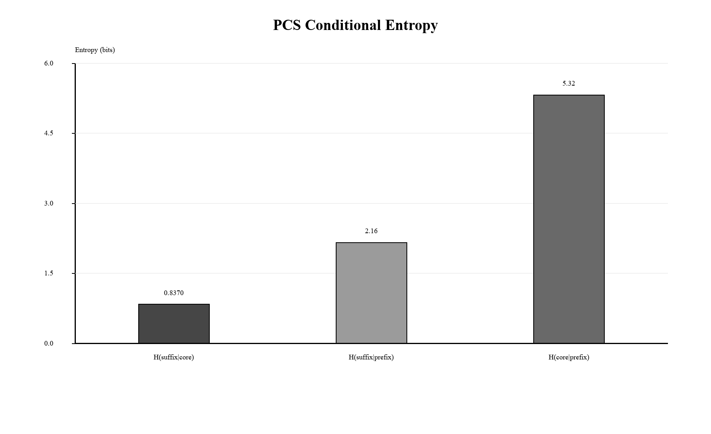
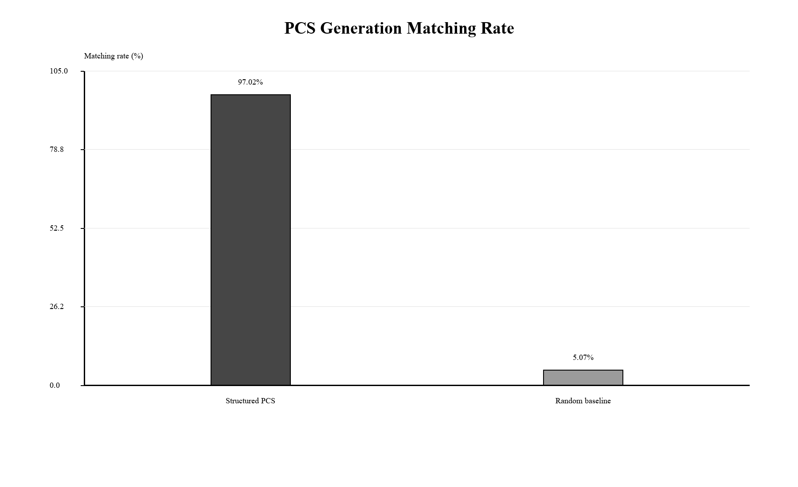
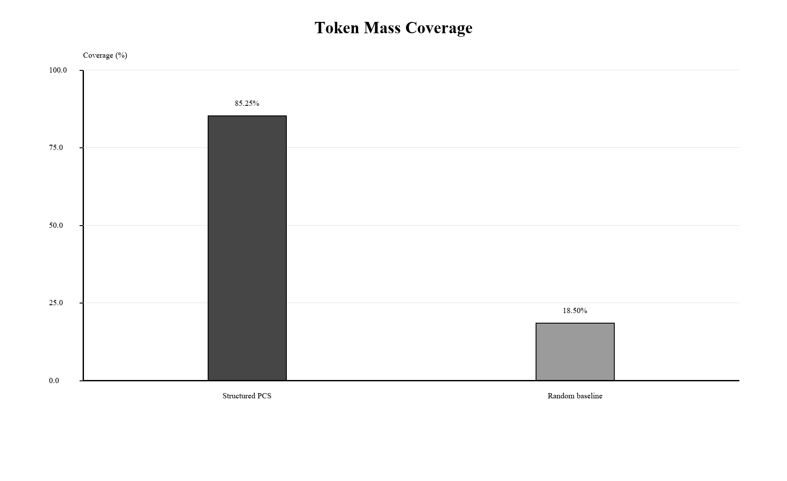
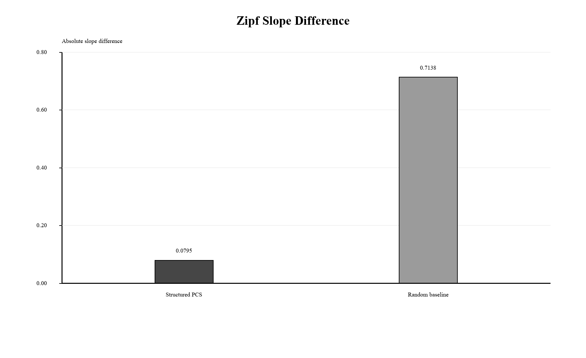
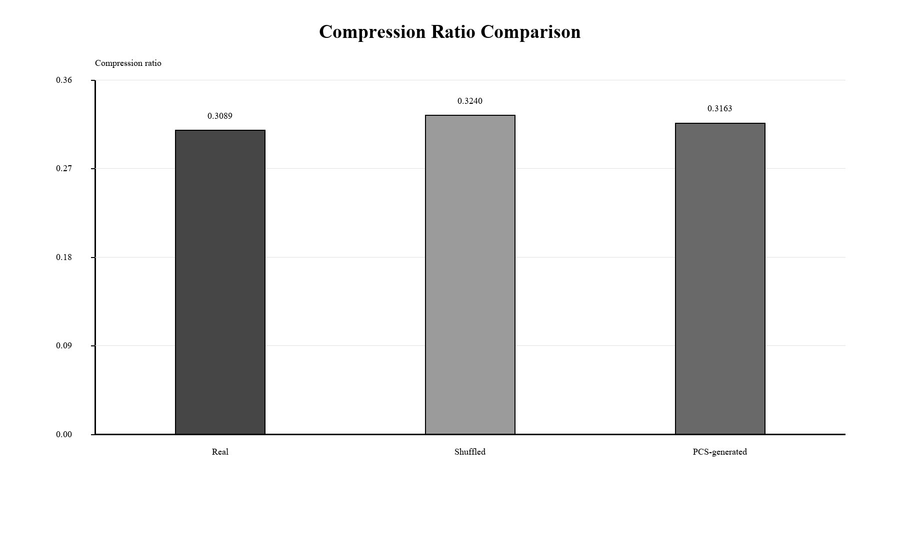
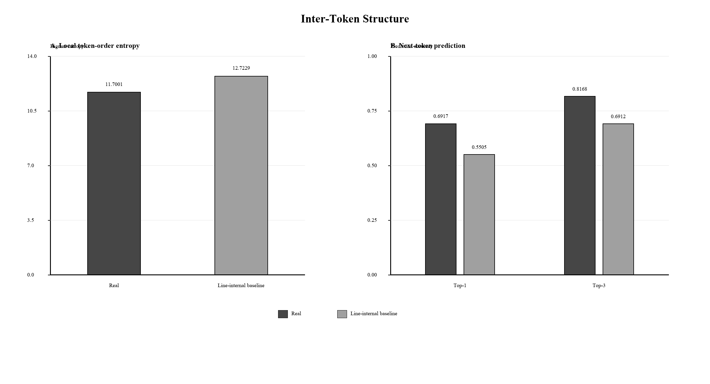

# Multi-Level Statistical Constraints in the Voynich Manuscript: From Token Structure to Sequential Organization

Youngsan Chang  
Independent Researcher  
April 2026

## AI Use Disclosure

AI-based tools (Claude, ChatGPT, Gemini) assisted with code implementation, figure generation, manuscript editing, and synthesis drafting across the component studies summarized in this paper. Research design, analytical decisions, statistical interpretation, and final argumentation were conducted by the author.

## Abstract

The Voynich Manuscript has long resisted definitive linguistic or cryptographic interpretation. Previous studies have shown that the manuscript is non-random in several respects, but isolated statistical regularities do not by themselves establish a coherent structural account. This paper synthesizes five linked studies into a multi-level statistical framework for evaluating the organization of Voynich tokens. The analysis integrates evidence from positional constraints, language-like predictability, prefix-core-suffix (PCS) conditional dependency, PCS token-generation modeling, and inter-token sequential structure. Across these levels, the manuscript exhibits robust deviations from random or low-complexity baselines. Positionally, specific token classes are strongly constrained by line and paragraph location. Predictively, Voynich tokens show natural-language-like entropy and ambiguity profiles while diverging from natural language in suffix concentration and prefix-family organization. Internally, tokens exhibit asymmetric PCS dependencies, with suffix selection strongly conditioned on the core. Generatively, a PCS model reproduces observed token forms at high matching and coverage rates while outperforming random baselines. Sequentially, adjacent tokens show lower bigram entropy, higher next-token predictability, component-linked transition effects, line-boundary structure, and local clustering of related token families. Taken together, the results support the interpretation of the Voynich text as a multi-level structured symbolic system. These findings do not constitute semantic decipherment, translation, or confirmation of full syntax. Instead, they establish a reproducible structural baseline that any future linguistic, cryptographic, or generative account of the manuscript must explain.

**Keywords:** Voynich Manuscript; multi-level structure; prefix-core-suffix; positional constraints; inter-token dependency; generative model; computational text analysis; unknown scripts

## 1. Introduction

The Voynich Manuscript remains one of the most persistent unsolved problems in historical linguistics, cryptography, and manuscript studies. Its writing system displays strong visual regularity, repeated token forms, and section-like organization, yet no proposed decipherment has achieved general acceptance. One central difficulty is that the manuscript appears neither plainly random nor straightforwardly comparable to ordinary natural-language prose. It exhibits statistical regularities, but those regularities have not yielded stable meaning.

A productive way to approach the problem is therefore not to begin with translation, but with structural constraints. If the text is meaningful, encoded, generated, or pseudo-generated, its token system should still exhibit constraints at one or more levels. Conversely, any proposed explanation must account for the distribution of tokens, their internal composition, their placement within lines and paragraphs, and their arrangement across adjacent positions.

This paper synthesizes five linked studies into a single multi-level account. The first study tested robust positional constraints in line-initial, paragraph-initial, and line-final contexts. The second compared Voynich token predictability against natural language, synthetic n-gram text, and structured data. The third examined token-internal conditional structure through a prefix-core-suffix decomposition. The fourth evaluated whether PCS components can generate observed token forms and reproduce distributional properties. The fifth tested whether local token order is itself non-random beyond token-level generation.

The purpose of the present paper is not to repeat each component study in full, but to integrate their results into one coherent framework. The central claim is conservative: the Voynich token system is structured across multiple levels. The paper does not claim semantic decipherment, identify a source language, or confirm a grammar. It argues instead that the manuscript exhibits reproducible organization across positional, predictive, token-internal, generative, and inter-token dimensions.

## 2. Literature Review

### 2.1 Statistical approaches to the Voynich Manuscript

Statistical analysis has long been central to Voynich research. Currier identified distinct textual varieties within the manuscript, showing that the corpus is internally heterogeneous rather than uniform. Landini (2001) reported evidence of linguistic structure using spectral analysis, while Montemurro and Zanette (2013) applied information-theoretic methods to co-occurrence and keyword structure. Reddy and Knight (2011) reviewed computational constraints on proposed explanations and emphasized the difficulty of reconciling surface regularities with ordinary linguistic expectations.

These studies showed that the text is not a simple random sequence, but they did not provide a full account of token formation or local ordering. The present synthesis builds on that tradition by treating non-randomness as a multi-level problem. Rather than asking only whether the text is globally language-like, it asks whether specific structural levels are independently constrained and mutually consistent.

### 2.2 Generative and pseudo-text explanations

A second line of research has explored whether the manuscript could be generated by mechanical or algorithmic procedures. Rugg (2004) showed that Cardan-grille-like methods can produce Voynich-like surface forms, and Timm and Schinner (2020) proposed self-referential generation mechanisms capable of reproducing some textual properties. These models are important because they demonstrate that apparent complexity alone is insufficient evidence for meaning.

However, a plausible generative explanation must account not only for surface token appearance, but also for positional constraints, component-conditioned dependencies, Zipf alignment, holdout generalization, compression behavior, line-boundary effects, and inter-token clustering. The present paper therefore evaluates structure across multiple baselines and levels rather than relying on a single global statistic.

### 2.3 Token morphology and slot-based models

Stolfi proposed that Voynich words can often be described through slot-like internal organization. This view motivates component-based analysis, but it leaves open whether the components are independently selected, statistically conditioned, or merely descriptive categories. The PCS framework developed in the component studies uses the terms prefix, core, and suffix in a strictly positional sense. The term core is preferred over stem because it avoids implying a known linguistic or morphological function.

This terminology is central to the interpretation. A stem normally implies a lexical or morphological unit in a known or recoverable language. The Voynich material does not permit that assumption. Core therefore refers only to the middle component left after positional prefix and suffix segmentation, and its importance is established statistically rather than semantically.

### 2.4 From isolated statistics to multi-level structure

Many individual properties of the Voynich text can be explained away if considered alone. Zipf-like distributions may arise from many systems; positional effects may reflect layout; token repetition may reflect generation; and entropy similarity may not imply meaning. The significance of the present synthesis lies in convergence: the same corpus exhibits constraints at multiple independent levels. A model that explains only one level remains incomplete if it fails at the others.

## 3. Research Questions

The integrated analysis is organized around six research questions.

- RQ1. Does the Voynich Manuscript exhibit multi-level non-random structure across token position, token predictability, token-internal composition, token generation, and local token arrangement?

- RQ2. Are specific tokens or token classes constrained by line and paragraph position?

- RQ3. Do Voynich tokens exhibit language-like predictability while remaining structurally distinct from known natural-language baselines?

- RQ4. Do token components exhibit asymmetric prefix-core-suffix conditional dependencies?

- RQ5. Can a PCS-based generative model reproduce observed token forms and corpus-level distributions better than random baselines?

- RQ6. Are generated or observed tokens arranged non-randomly across local inter-token sequences?

## 4. Data

All component studies use the Zandbergen-Landini EVA transcription (ZL3b) as their primary data source. The exact working corpus differs across analyses because each study applies task-specific preprocessing. Positional analysis uses a conservative line- and paragraph-aware parser. PCS analysis excludes tokens too short for component segmentation. The PCS generation model uses the token inventory appropriate to model construction, while the inter-token study preserves line boundaries and local order.

These differences are methodological rather than contradictory. Each analysis defines the working corpus needed for its own test. The integrated paper therefore treats the component results as complementary structural probes rather than as a single uniform token count.

Table 1 summarizes the five component studies and clarifies how each contributes a separate structural test. The table is included early because the integrated argument depends on convergence across levels rather than on a single statistic.

| Study | Structural level | Main question | Core result |
| --- | --- | --- | --- |
| Chang 2026a | Position | Are token classes positionally constrained? | Line and paragraph positional constraints survive permutation baselines. |
| Chang 2026b | Predictability | Does Voynich resemble natural language statistically? | Entropy and ambiguity correlations exceed 0.95 while suffix and prefix-family structure diverge. |
| Chang 2026c | Token-internal PCS | Are components conditionally dependent? | Suffix is strongly predicted by core: H(suffix&#124;core) = 0.8370; top-1 accuracy = 79.11%. |
| Chang 2026d | Token generation | Can PCS reproduce observed tokens? | PCS model achieves 97.02% matching and 85.25% token mass coverage. |
| Chang 2026e | Inter-token arrangement | Is local token order non-random? | Real sequences show lower entropy, higher prediction accuracy, and local family clustering. |

*Table 1. Overview of the five component studies. Each study tests a distinct structural level rather than repeating a single global non-randomness claim.*

## 5. Methods

Tables 2 and 3 summarize the methodological design across the five component studies. The first table isolates corpus scope and preprocessing decisions, while the second table summarizes metrics, baselines, statistical tests, and primary outputs.

| Study | Corpus / subset | Preprocessing rule |
| --- | --- | --- |
| Chang 2026a | Line- and paragraph-aware ZL3b EVA transcription subset. | Preserves line and paragraph position; parses line-initial, line-final, and paragraph-initial contexts. |
| Chang 2026b | Voynich ZL3b plus English, Latin, synthetic n-gram, and JSON/structured comparison datasets. | Size-matched comparison; current normalization plus robustness modes where available. |
| Chang 2026c | ZL3b token set suitable for PCS segmentation. | Prefix length 2, suffix length 1, core as middle component; tokens with empty core excluded. |
| Chang 2026d | ZL3b token-generation corpus and PCS component inventory. | Operational PCS extraction; fixed-length segmentation variants; train/test holdout splits. |
| Chang 2026e | Line-preserving ZL3b corpus: 23,753 tokens, 12,688 types, 8,510 lines. | Preserves token order and line boundaries; uses PCS segmentations and morphological families where available. |

*Table 2. Methods summary: corpus and preprocessing. The table separates corpus scope and preprocessing rules because the component studies use task-specific working subsets.*

| Study | Main metrics | Baselines / statistical tests | Primary output |
| --- | --- | --- | --- |
| Chang 2026a | dshedy line-initial bias; p/t/k paragraph-initial concentration; am-class line-final bias. | Global token shuffle; line-internal shuffle; position-restricted shuffle; permutation trials N = 1,000. | Position-specific constraint evidence with empirical p-value framework. |
| Chang 2026b | Entropy decay; ambiguity persistence; prefix-family overlap; suffix distribution concentration. | Frequency-preserving shuffle; length-preserving randomization; prefix-preserving/global suffix model; size-matched bootstrap/permutation where specified. | Comparative evidence for language-like predictability and structural divergence. |
| Chang 2026c | Mutual information; conditional entropy; top-1/top-3 prediction accuracy; structure-break tests. | Character-shuffled and n-gram baselines; shuffle_cores_only, shuffle_suffixes_only, shuffle_prefixes_only perturbations. | Asymmetric PCS dependency, especially H(suffix&#124;core). |
| Chang 2026d | Matching rate; token mass coverage; Zipf slope difference; H(suffix&#124;core); compression ratio; morphological families. | Random and shuffled baselines; fixed-length segmentation experiments; bootstrap validation; holdout splits 80/20, 70/30, 50/50. | PCS token-generation performance and robustness validation. |
| Chang 2026e | Bigram/trigram entropy; next-token top-1/top-3; PCS transition entropy; line-boundary chi-square; family distance. | Full shuffle; frequency-preserving shuffle; line-internal shuffle; N = 1,000 where computationally feasible. | Evidence for non-random inter-token arrangement and line-level organization. |

*Table 3. Methods summary: analytical design. Baselines and tests are listed compactly; detailed reproduction materials are linked through the component package DOI records.*

### 5.1 Positional constraint testing

The positional study tested three pre-specified effects: a line-initial bias for the token dshedy, a paragraph-initial concentration of p/t/k initials, and a line-final bias for the am-class token set. These effects were evaluated under global token shuffle, line-internal shuffle, and position-restricted null models. Empirical p-values were computed using permutation tests.

The key methodological feature is that the null models become progressively stricter. The line-internal shuffle preserves line-level lexical composition while disrupting positional order, and the position-restricted model controls for generic line-initial effects when testing paragraph-initial concentration.

### 5.2 Comparative predictability analysis

The comparative study evaluated entropy decay, ambiguity persistence, and prefix-family distributions across Voynich, English, Latin, synthetic n-gram text, and structured data. Baseline corpora were size-matched and processed under comparable tokenization procedures. The analysis tested whether Voynich predictability resembles natural language and whether simple null models reproduce its ambiguity behavior.

### 5.3 Prefix-core-suffix conditional analysis

The PCS dependency study segmented tokens into prefix, core, and suffix components. In the fixed segmentation used there, prefix length was 2 and suffix length was 1, with the remaining middle segment defined as the core. The analysis computed mutual information, conditional entropy, and prediction accuracy for component pairs, and performed structure-breaking experiments by shuffling cores, suffixes, or prefixes.

### 5.4 PCS token-generation modeling

The token-generation study constructed a PCS model by extracting candidate prefixes, cores, and suffixes and recombining them under observed component distributions. The generated vocabulary was compared against the real corpus using matching rate, token mass coverage, Zipf slope difference, conditional entropy, fixed-length segmentation tests, bootstrap validation, holdout validation, morphological-family analysis, transition analysis, and compression-based evaluation.

### 5.5 Inter-token sequence analysis

The inter-token study preserved local token order and line boundaries. It evaluated token bigram and trigram entropy, next-token prediction accuracy, PCS component transitions across token boundaries, line-boundary effects, recurrent PCS patterns, and family clustering. The primary baseline was a line-internal shuffle, which preserves which tokens occur in a line while disrupting their local order.

## 6. Results

### 6.1 Positional constraints are robust under null models

The positional study found that three independent token-position effects remain highly significant under multiple permutation baselines. The line-initial concentration of dshedy, paragraph-initial concentration of p/t/k initials, and line-final concentration of the am-class all survive stricter null assumptions. In each case, the observed effect is far outside the permutation distribution, with empirical p = 0.000999 under the tested 1,000-trial framework.

This result establishes the first structural layer: token placement is not freely exchangeable across line and paragraph positions. Any generative model must therefore explain not only token shapes, but also why particular token classes occur preferentially at specific structural positions.

### 6.2 Voynich tokens are predictability-like but structurally divergent

The comparative study found that Voynich entropy and ambiguity curves correlate strongly with natural-language baselines. Entropy and ambiguity correlations exceed approximately 0.95 for English and Latin comparisons. At the same time, Voynich differs sharply from natural languages in prefix-family overlap and suffix concentration. Simple null models fail to reproduce ambiguity persistence beyond intermediate prefix lengths.

This establishes the second structural layer: Voynich has language-like predictability dynamics, but those dynamics coexist with structural constraints not typical of the tested natural-language baselines. The manuscript is therefore not well characterized as either ordinary natural language or trivial random generation.

### 6.3 PCS components show asymmetric conditional dependency

The PCS dependency study found a strong asymmetry among token components. Suffix selection is highly predictable from the core, with H(suffix|core) = 0.8370 and top-1 prediction accuracy of 79.11%. In contrast, core prediction from prefix is weak, with H(core|prefix) = 5.3205 and top-1 accuracy of 18.13%.

Figure 1 summarizes this asymmetry visually. The lower value of H(suffix|core) indicates that, once the core is known, the suffix distribution is much more constrained than the reverse relation from prefix to core.

*Figure 1. Conditional entropy in PCS components. The comparison supports the interpretation that the operationally defined core is a major conditioning element for suffix selection, without implying that the core has been semantically deciphered.*

Structure-breaking experiments support the same conclusion. Shuffling core material produces greater statistical disruption than shuffling suffixes or prefixes. This indicates that the core component functions as the main structural carrier in token generation, while suffixes behave as form-stabilizing elements conditioned on the core.

### 6.4 PCS generation reproduces observed token structure

The PCS token-generation model achieves a 97.02% matching rate against the observed corpus, compared with 5.07% for the random baseline. Figure 2 shows the magnitude of this difference.

*Figure 2. PCS generation matching rate. The PCS model reproduces observed token forms at a substantially higher rate than the random baseline.*

Token mass coverage reaches 85.25%, compared with 18.50% for the random baseline. Figure 3 shows that the advantage is not limited to rare or peripheral forms; it also covers a large share of corpus token mass.

*Figure 3. Token mass coverage. The PCS model captures much more observed token mass than the random baseline.*

The PCS model also closely tracks the Zipf-like distribution of the real corpus, with a Zipf slope difference of 0.0795 compared with 0.7138 for the random baseline. Figure 4 summarizes this contrast.

*Figure 4. Zipf slope difference. Lower difference indicates closer agreement with the observed rank-frequency profile.*

Additional validation reduces the risk that these results are merely artifacts of flexible segmentation. Fixed-length experiments preserve the structured model advantage, bootstrap testing yields empirical p < .001, and holdout validation across 80/20, 70/30, and 50/50 splits supports generalization beyond the training set.

Compression analysis provides a further corpus-level check. Figure 5 compares the real corpus, a shuffled corpus, and the PCS-generated corpus. The real and PCS-generated corpora are more compressible than the shuffled baseline, consistent with structural regularity.

*Figure 5. Compression ratio comparison. Lower compression ratios indicate greater regularity; the PCS-generated corpus remains closer to the real corpus than to the shuffled baseline.*

### 6.5 Inter-token arrangement is non-random

The inter-token study extends the framework from token generation to token arrangement. Real Voynich sequences show lower bigram entropy than shuffled baselines. The real bigram entropy is 11.7001, compared with 13.5343 under full shuffle, 13.5343 under frequency-preserving shuffle, and 12.7229 under line-internal shuffle. Next-token prediction accuracy is also higher in the real corpus than the line-internal baseline: top-1 accuracy is 0.6917 vs. 0.5505, and top-3 accuracy is 0.8168 vs. 0.6912.

Figure 6 combines the main inter-token entropy and prediction results. The figure is intended as a compact summary of local sequence constraint, not as evidence of semantic syntax.

*Figure 6. Inter-token entropy and next-token prediction from Chang (2026e). Real sequences show lower bigram entropy and higher next-token prediction accuracy than the line-internal shuffled baseline.*

Component-level inter-token transitions further support this conclusion. The suffix(token_i) -> prefix(token_i+1) pathway has real conditional entropy of 4.4008 compared with a baseline mean of 4.5087, while the core(token_i) -> core(token_i+1) pathway shows a stronger entropy reduction. Line-boundary metrics are also significant: within-line transition entropy is 11.7001, cross-line transition entropy is 11.9831, and line-position dependence yields chi-square = 46151.0531 with p < .001.

Finally, related token families cluster locally. Tokens sharing the same core occur closer together in the real corpus than in shuffled baselines, with mean distance 235.93 vs. 442.77. Tokens sharing the same prefix-core structure show the same pattern, with mean distance 319.98 vs. 632.90. These results establish the fifth structural layer: generated or observed tokens are not merely independent forms, but participate in local sequential organization.

### 6.6 Integrated result

The component studies converge on a single structural interpretation. The Voynich token system is positionally constrained, language-like in predictability, asymmetrically organized internally, reproducible by a PCS generation model, and locally ordered across adjacent tokens.

Table 4 integrates the principal evidence across structural levels. It is useful as a compact checklist for future models, because a model that explains only one row remains incomplete.

| Level | Principal evidence | Interpretation |
| --- | --- | --- |
| Position | Line-initial, paragraph-initial, and line-final constraints survive permutation baselines. | Token placement is position-sensitive. |
| Predictability | Entropy and ambiguity curves align with natural-language-like dynamics. | The token system has non-trivial predictive structure. |
| Structural divergence | Suffix concentration and prefix-family organization differ from natural language. | Similar predictability does not imply ordinary natural-language morphology. |
| PCS dependency | H(suffix&#124;core) = 0.8370; suffix-from-core top-1 accuracy = 79.11%. | Token generation is conditionally organized around the core. |
| PCS generation | Matching rate 97.02%; coverage 85.25%; Zipf slope difference 0.0795. | PCS composition reproduces observed token structure. |
| Inter-token order | Lower bigram entropy and higher next-token prediction than shuffled baselines. | Local token arrangement is non-random. |
| Line structure | Within-line/cross-line entropy contrast and chi-square position dependence. | Line boundaries participate in structural organization. |
| Family clustering | Related token families occur closer together than shuffled baselines. | Related forms are locally organized. |

*Table 4. Integrated evidence across structural levels. The evidence is interpreted as coordinated structural organization, not semantic decipherment.*

Table 5 gives the most important numerical values in one place. These values are not treated as independent proofs; rather, they are interpreted as converging constraints across position, component structure, generation, and local sequence organization.

| Measure | Observed / model value | Baseline / contrast | Interpretation |
| --- | --- | --- | --- |
| PCS matching rate | 97.02% | Random baseline 5.07% | Structured recombination reproduces observed forms far better than random generation. |
| Token mass coverage | 85.25% | Random baseline 18.50% | Frequent corpus mass is captured by the PCS model. |
| Zipf slope difference | 0.0795 | Random baseline 0.7138 | Generated distribution remains close to real frequency structure. |
| H(suffix&#124;core) | 0.8370 | H(core&#124;prefix) = 5.3205 | Suffix selection is much more constrained by core than core is by prefix. |
| Compression ratio | Real 0.3089; PCS 0.3163 | Shuffled 0.3240 | Real and PCS-generated corpora are more compressible than shuffled text. |
| Bigram entropy | Real 11.7001 | Line-internal shuffle 12.7229 | Real local ordering is more constrained than line-preserving randomization. |
| Next-token prediction | Top-1 0.6917; top-3 0.8168 | Baseline top-1 0.5505; top-3 0.6912 | Observed local sequences improve next-token predictability. |
| Line-position dependence | Chi-square = 46151.0531 | p < .001 | Line position is statistically associated with token distribution. |
| Family clustering | Same-core mean distance 235.93 | Shuffled 442.77 | Related token families cluster locally. |

*Table 5. Key quantitative findings summary. Values are drawn from the component studies and are used as cross-level constraints for future models.*

## 7. Discussion

### 7.1 From isolated regularities to a multi-level structural system

The main contribution of this integrated paper is the shift from isolated statistical observations to a multi-level structural account. Each component study tests a different level of organization, and the results are mutually reinforcing. Positional constraints show that token placement is not arbitrary. Comparative predictability shows that the token system has language-like dynamics while remaining structurally distinct from natural language. PCS dependency analysis identifies an internal conditional architecture. PCS generation demonstrates that the architecture can reproduce a large portion of the observed token system. Inter-token analysis shows that local ordering is also constrained.

This convergence is stronger than any individual result. A simple pseudo-text generator might reproduce token shapes but fail at position. A language-like entropy curve might arise without PCS dependency. A PCS token model might generate plausible forms but fail to reproduce local ordering. The integrated evidence requires an explanation that operates across several structural levels simultaneously.

### 7.2 The role of the core component

Across the PCS studies, the core component emerges as a central structural carrier. It strongly conditions suffix selection within tokens and also participates in cross-token continuity through core-to-next-core transitions. This does not mean that the core has been semantically identified. It means that the middle component of the token, defined positionally, carries a disproportionate share of the statistical structure.

The choice of the term core is therefore important. The analysis does not assume a stem in the linguistic sense. It identifies a central component that behaves as a conditioning unit within the token system. This distinction keeps the interpretation structural rather than morphological in the conventional linguistic sense.

### 7.3 What the results do not show

The integrated results do not decipher the manuscript. They do not identify a source language, assign meanings to tokens, translate lines, or confirm syntactic categories. Terms such as prefix, core, suffix, token family, and local recurrence are used operationally. Similarly, phrase-like recurrence means repeated local structure, not confirmed semantic phrasing.

The safest conclusion is that the manuscript exhibits multi-level non-random organization. Whether this organization reflects a natural language encoded in an unusual way, a specialized symbolic notation, a constructed system, scribal conventions, a pseudo-text generator with higher-order constraints, or some combination of these remains unresolved.

### 7.4 Implications for future models

Any future model of the Voynich Manuscript should satisfy at least five constraints. First, it should reproduce positional effects at line and paragraph boundaries. Second, it should preserve language-like entropy and ambiguity dynamics without reducing the text to ordinary natural-language morphology. Third, it should account for asymmetric PCS dependency, especially the core-conditioned suffix system. Fourth, it should reproduce observed token forms and distributional properties under holdout validation. Fifth, it should generate non-random local token order and line-boundary effects.

A model that explains only one layer should not be considered sufficient. The present synthesis provides a falsifiable checklist for evaluating future linguistic, cryptographic, or generative proposals.

## 8. Limitations

First, all component studies depend on the Zandbergen-Landini EVA transcription. Alternative transcriptions or tokenization conventions may affect token counts, component segmentation, and line-boundary statistics.

Second, the component studies use different preprocessing rules appropriate to their research questions. This means that token totals are not identical across all analyses. The integrated claim concerns convergence across structural probes, not uniformity of corpus counts.

Third, PCS segmentation is operational rather than semantic. Prefix, core, and suffix are positional components, not confirmed linguistic morphemes.

Fourth, the high PCS matching rate may partly reflect combinatorial capacity. Fixed-length validation, bootstrap testing, holdout validation, Zipf alignment, compression, and family analyses reduce this concern but do not eliminate the need for further precision-oriented testing.

Fifth, shuffled baselines do not exhaust all possible generative mechanisms. More complex pseudo-text generators could be designed to reproduce some of the observed effects. Future work should compare the integrated metrics against explicit generative algorithms.

Sixth, local sequential structure does not establish full grammar. Inter-token dependency and line-boundary structure are evidence of arrangement, not translation.

## 9. Conclusion

This paper synthesizes five linked statistical studies of the Voynich Manuscript into a multi-level structural framework. The evidence indicates that the manuscript is not merely non-random in a broad distributional sense. It is structured across multiple levels: token position, predictability, token-internal dependency, token generation, and local inter-token arrangement.

The integrated results support the interpretation of the Voynich text as a multi-level structured symbolic system. This interpretation remains independent of semantic decipherment. It does not establish what the tokens mean, whether they encode a known language, or whether the system is linguistic, cryptographic, mnemonic, classificatory, or artificially generated. It establishes instead that any satisfactory account of the manuscript must explain a coordinated set of structural constraints.

## 10. Future Work

Future work should extend this framework from global token structure to section-specific structural zoning. In particular, the next stage should test whether PCS distributions, token-family concentrations, inter-token transitions, and line-boundary effects vary systematically across folios, manuscript sections, visual categories, and local zones. Such analysis would ask whether herbal, astronomical, biological, cosmological, and recipe-like sections show distinct structural signatures without assuming that the section labels correspond to semantic categories.

This direction is especially important because the integrated studies mostly treat the corpus as a whole. A section-specific analysis could determine whether the same structural system operates uniformly across the manuscript or whether different folio groups use different token-generation and inter-token organization regimes. It may also test whether visual layout, paragraph density, illustration category, and folio position predict changes in prefix-family size, suffix concentration, line-initial behavior, and family clustering.

Such analysis would move the project from global structure toward section-specific structural zoning: a map of where particular token mechanisms are strengthened, weakened, or reorganized across the manuscript.

## Data and Code Availability

This integrated manuscript synthesizes five component studies. The component paper DOI records and component reproduction package DOI records are intentionally distinct: paper DOI records identify manuscripts, while package DOI records identify associated code, data, figures, tables, and reproduction materials.

Component paper DOIs are as follows: Paper 1, https://doi.org/10.5281/zenodo.19687875; Paper 2, https://doi.org/10.5281/zenodo.19737888; Paper 3, https://doi.org/10.5281/zenodo.19765707; Paper 4, https://doi.org/10.5281/zenodo.19858094; Paper 5, https://doi.org/10.5281/zenodo.19869629.

Component package DOI records are as follows: Paper 1 package/concept, https://doi.org/10.5281/zenodo.19689753; Paper 2 package, https://doi.org/10.5281/zenodo.19737444; Paper 3 package, https://doi.org/10.5281/zenodo.19765403; Paper 4 package, https://doi.org/10.5281/zenodo.19857820; Paper 5 package, https://doi.org/10.5281/zenodo.19869615.

## Acknowledgements

AI-based tools (Claude, ChatGPT, Gemini) assisted with code implementation, figure generation, manuscript editing, and synthesis drafting. Research design, analytical decisions, statistical interpretation, and final argumentation were conducted by the author.

## References

Bennett, W. R. (1976). Scientific and Engineering Problem Solving with the Computer. Prentice Hall.

Chang, Y. (2026a). Robust positional constraints in the Voynich Manuscript: Toward a structured token architecture. Zenodo. https://doi.org/10.5281/zenodo.19687875

Chang, Y. (2026b). Language-like predictability and structural divergence in Voynich tokens: A comparative statistical study. Zenodo. https://doi.org/10.5281/zenodo.19737888

Chang, Y. (2026c). Conditional structure and generative dependencies in Voynich tokens: A prefix-core-suffix analysis. Zenodo. https://doi.org/10.5281/zenodo.19765707

Chang, Y. (2026d). Evidence for a structured token-generation system in the Voynich Manuscript. Zenodo. https://doi.org/10.5281/zenodo.19858094

Chang, Y. (2026e). Beyond token generation: Inter-token structure in the Voynich Manuscript. Zenodo. https://doi.org/10.5281/zenodo.19869629

Currier, P. H. (1976). Some important new statistical findings. In M. D'Imperio (Ed.), New research on the Voynich Manuscript: Proceedings of a seminar (pp. 1-10). National Security Agency.

Landini, G. (2001). Evidence of linguistic structure in the Voynich Manuscript using spectral analysis. Cryptologia, 25(4), 275-295.

Montemurro, M. A., & Zanette, D. H. (2013). Keywords and co-occurrence patterns in the Voynich Manuscript: An information-theoretic analysis. PLOS ONE, 8(6), e66344.

Parisel, O. (2026). Evidence of layered positional and directional constraints in the Voynich Manuscript: Implications for cipher-like structure. arXiv preprint arXiv:2604.19762.

Reddy, S., & Knight, K. (2011). What we know about the Voynich Manuscript. Proceedings of the 5th ACL-HLT Workshop on Language Technology for Cultural Heritage, Social Sciences, and Humanities, 78-85.

Rugg, G. (2004). An elegant hoax? A possible solution to the Voynich Manuscript. Cryptologia, 28(1), 31-46.

Stolfi, J. (1997). A morphological analysis of Voynich text. Unpublished manuscript. https://www.ic.unicamp.br/~stolfi/voynich/

Timm, T., & Schinner, A. (2020). A possible generating algorithm of the Voynich manuscript. Cryptologia, 44(1), 1-19. https://doi.org/10.1080/01611194.2019.1596999

Zandbergen, R. (2025). ZL3b EVA transcription files. Voynich.nu. https://www.voynich.nu
